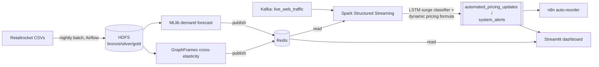

# Supply Chain Demand Forecasting & Dynamic Pricing

A production-grade **Lambda-architecture** big-data platform that forecasts retail demand and sets
prices dynamically in real time. Historical sales train a nightly baseline (batch layer); live
clickstream traffic modulates prices within seconds (speed layer); Redis + a dashboard serve results.

Built on **Apache Spark** (SQL, MLlib, GraphFrames, Structured Streaming, Deep Learning),
**Apache Kafka**, and **Hadoop/HDFS**, orchestrated across a 5-person team.

---

## Architecture at a glance



See [`docs/architecture/system-design.md`](docs/architecture/system-design.md) for the full design
and [`docs/architecture/data-contracts.md`](docs/architecture/data-contracts.md) for the interface
contracts that let all five layers integrate.

**Diagrams (Miro):** [Supply Chain Forecasting — System Design](https://miro.com/app/board/uXjVH99Wkbw=/)
— architecture, user stories, system design, and per-layer (Spark/Kafka/Hadoop) diagrams.

**Demo (Canva):** [Project walkthrough](https://canva.link/sfjo8nfgzsi8tfw)

## Team & ownership

| Member | Layer owned | Directory |
|---|---|---|
| **Nashat** (Tech Lead) | Speed layer: streaming + LSTM + pricing; shared `contracts/`; CI/CD | [`streaming/`](streaming/) |
| **Emad** (Data/ML Lead) | Batch layer: ETL + MLlib + GraphFrames; Airflow; data quality | [`batch/`](batch/) |
| **Nagy** | Infrastructure: Docker/HDFS/Spark/Kafka/Redis; monitoring; K8s | [`infra/`](infra/) |
| **Hatem** | Ingestion & simulation: Kafka topics, traffic generator | [`ingestion/`](ingestion/) |
| **Ziad** | Automation & serving: n8n, Streamlit dashboard | [`automation/`](automation/) |

Full plans: [master plan](docs/master-plan.md) · per-member plans in [`docs/plans/`](docs/plans/).

**New to the repo?** Open this repo in Claude Code and ask it to "onboard me" (or run `/scf-onboard
<your-name>`) — it reads `.claude/skills/scf-onboard/SKILL.md` and gives you your layer, your next
open task, and the git/PR conventions in under a minute.

**Financial & pricing strategy:** [pricing-strategy](docs/reference/pricing-strategy.md) (value-based +
honest psychology) · [financial-model](docs/reference/financial-model.md) (ROI business case) ·
[cost-and-licensing](docs/reference/cost-and-licensing.md) (zero-cost guarantee).

**Technical playbooks:** [kafka-playbook](docs/reference/kafka-playbook.md) ·
[spark-playbook](docs/reference/spark-playbook.md) · [mlops-playbook](docs/reference/mlops-playbook.md).

## Quick start — from a fresh clone to a working dashboard

### Prerequisites

- **Docker Desktop** ≥ 4.30 (or Docker Engine 26+), with **≥ 8 CPUs / 12 GB RAM** allocated
  (Settings → Resources). The stack runs Spark + Kafka + HDFS + Airflow + monitoring concurrently.
- **Python 3.10+** and `make` (both preinstalled on macOS/Linux; on Windows use Git Bash or WSL2).
- A free **Kaggle account** + API token, for the dataset only (step 3 below).
- Ports free on your machine: `2181 5000 5432 5678 6379 7077 8081 8082 8088 8501 9000 9090 9092
  9121 9308 9870 29092 3001`. Nothing else should be listening on these before `make up`.

### Step-by-step

**1. Clone and enter the repo**
```bash
git clone https://github.com/ahmednashatnoaman-svg/supply-chain-forecasting.git
cd supply-chain-forecasting
```

**2. Set up the Python environment**
```bash
cp .env.example .env          # default values work out of the box for local dev
make setup                    # creates .venv, installs deps + pre-commit hooks
```

**3. Get the dataset** (Kaggle account + API token needed — [instructions](https://www.kaggle.com/docs/api#authentication))
```bash
make data                     # downloads Retailrocket + splits 80/20 train/test
```
See [ADR-0004](docs/architecture/adr/0004-dataset-choice.md) for why this dataset was chosen over
Instacart. `~/.kaggle/kaggle.json` must exist before this step; `make data` uses it automatically.

**4. Start the full stack** (18 containers: Kafka, HDFS, Spark, Redis, Airflow, MLflow, n8n,
Prometheus, Grafana, and more)
```bash
make up                       # docker compose up + bootstrap.sh (creates Kafka topics + HDFS dirs)
make ps                       # confirm everything shows "healthy" or "Up"
```
First run pulls ~15 GB of images — expect several minutes. If any pull times out (Docker Hub is
occasionally flaky), just re-run `make up`; it resumes from whatever already downloaded.

**5. Stage the dataset into HDFS**
```bash
bash scripts/hdfs_load.sh     # stages the 80% train split + item_properties into HDFS bronze
```

**6. Run the pipeline — three independent pieces, each in its own terminal (or background)**
```bash
make ingest                   # replays the 20% test split to Kafka as live clickstream traffic
make stream                   # streaming pricing engine: consumes traffic, writes Redis
make batch                    # nightly forecast + elasticity graph, writes Redis (takes a few min)
```

**7. See it working**
```bash
make dashboard                # opens the Streamlit command center at http://localhost:8501
```
Then open:
| What | Where | Login |
|---|---|---|
| Streamlit dashboard | http://localhost:8501 | — |
| Grafana (Platform Overview) | http://localhost:3001 | `admin` / `admin` (or `GRAFANA_ADMIN_PASSWORD` from `.env`) |
| n8n (auto-reorder executions) | http://localhost:5678 | `admin` / `changeme` (or your `.env` override) |
| Airflow | http://localhost:8082 | `admin` / `admin` |
| MLflow (model registry) | http://localhost:5000 | — |
| Spark Master UI | http://localhost:8088 | — |

**8. Verify it's not just "up" but actually producing data**
```bash
docker exec scf-redis-1 redis-cli --scan --pattern "price:current:*" | wc -l    # should be > 0
docker exec scf-redis-1 redis-cli --scan --pattern "forecast:*" | wc -l        # should be > 0
```

For everything else — what each container does, how to watch each layer live, troubleshooting a
specific failure, and known operational gotchas (external-volume Docker data folders, BuildKit
wedging, Docker Hub rate limits, Grafana password resets) — see
[`docs/runbooks/orchestration-guide.md`](docs/runbooks/orchestration-guide.md). See
[`docs/runbooks/`](docs/runbooks/) generally for startup/shutdown, scaling, and troubleshooting, and
[`docs/reference/project-brief.md`](docs/reference/project-brief.md) for the original brief.

## Docker images

Each of the 5 custom services builds its own image from `infra/docker/*.Dockerfile` and is published
publicly on Docker Hub under [`ahmednashat1`](https://hub.docker.com/u/ahmednashat1):

| Image | Docker Hub | Builds from | Base |
|---|---|---|---|
| `scf-dashboard` | [ahmednashat1/scf-dashboard](https://hub.docker.com/r/ahmednashat1/scf-dashboard) | `infra/docker/dashboard.Dockerfile` | `python:3.10-slim` |
| `scf-pricing-stream` | [ahmednashat1/scf-pricing-stream](https://hub.docker.com/r/ahmednashat1/scf-pricing-stream) | `infra/docker/pricing-stream.Dockerfile` | `apache/spark:3.5.1` (same jars as the cluster) |
| `scf-batch-pipeline` | [ahmednashat1/scf-batch-pipeline](https://hub.docker.com/r/ahmednashat1/scf-batch-pipeline) | `infra/docker/batch-pipeline.Dockerfile` | `apache/spark:3.5.1` |
| `scf-traffic-generator` | [ahmednashat1/scf-traffic-generator](https://hub.docker.com/r/ahmednashat1/scf-traffic-generator) | `infra/docker/traffic-generator.Dockerfile` | `python:3.10-slim` |
| `scf-airflow` | [ahmednashat1/scf-airflow](https://hub.docker.com/r/ahmednashat1/scf-airflow) | `infra/docker/airflow.Dockerfile` | `apache/airflow:2.9.2` |

```bash
docker pull ahmednashat1/scf-dashboard:latest
# (repeat for the other 4), or build locally instead:
docker build -f infra/docker/dashboard.Dockerfile -t scf-dashboard .
```

All 5 are public — no Docker Hub auth needed to pull. Every other service in `docker-compose.yml`
also pulls a public prebuilt image, so `make up` needs no Docker Hub auth at all either way.

## Tech stack

Spark 3.5 · Hadoop 3.3 (HDFS) · Kafka 3.x + Schema Registry (Avro) · Redis 7 · GraphFrames ·
PyTorch (LSTM) · MLflow · Airflow · Great Expectations · n8n · Streamlit · Prometheus + Grafana ·
Docker Compose (dev) / Helm + Terraform (cloud-ready) · GitHub Actions CI/CD.

## License

[MIT](LICENSE)
