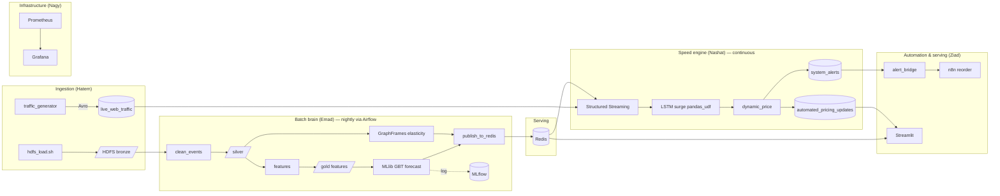

# System Design

Deep-dive into component internals and data flow. High-level rationale lives in the
[design spec](../superpowers/specs/2026-07-06-supply-chain-forecasting-design.md).

## 1. Data flow (end to end)

## 2. Component internals

### Batch (Emad)
- **Medallion:** bronze (raw parquet), silver (cleansed, typed), gold (features + forecast + graph).
- **Features:** Spark `Window` per `item_id` ordered by day; `rowsBetween(-6,0)` and `(-29,0)` for 7d/30d
  velocity; calendar features (`dow`, `is_weekend`).
- **Forecast:** `VectorAssembler` → `GBTRegressor`; predictions clamped ≥ 0; logged to MLflow.
- **Graph:** basket self-join → co-occurrence edges → `GraphFrame`; `pageRank` for item importance,
  `labelPropagation` for communities; elasticity weight = normalized co-occurrence.
- **Publish:** per-SKU atomic Redis pipeline writes (see contracts). Idempotent per run date.

### Speed (Nashat)
- **Read:** `readStream` Kafka `live_web_traffic`, Avro-deserialized via Schema Registry.
- **Velocity:** event-time sliding window (`STREAMING_WINDOW_SECONDS`) counting transactions per SKU.
- **Surge:** LSTM `pandas_udf` over recent per-SKU event sequences → surge probability; broadcast weights;
  **fallback = 0.0** if model missing (stream never blocks).
- **Price:** `dynamic_price(base, velocity, baseline, elasticity, is_surge, cfg)`; reads
  `forecast:{sku}` + `graph:elasticity:{sku}` from Redis; clamps to `[min_margin, max_uplift]`.
- **Emit:** Avro to `automated_pricing_updates`; low `inventory:{sku}` during surge → `system_alerts`.

### Serving (Ziad)
- **Dashboard:** thin Streamlit pages; all Redis access in `redis_source` (unit-tested with fakeredis).
- **Automation:** `alert_bridge` consumes `system_alerts`, POSTs `build_reorder(...)` to n8n webhook.

### Infra (Nagy)
- Compose network `scf-net`; profiles `core`/`full`; health checks gate `bootstrap.sh`.
- Monitoring: exporters (kafka, redis) + app `/metrics` scraped by Prometheus → Grafana dashboards.

## 3. Failure & consistency model

- **Redis is the single source of truth for serving.** Batch writes atomically per SKU; the stream only
  reads. No dual-write races.
- **Replayability:** batch jobs are idempotent per date; streaming uses Kafka offsets + checkpointing.
- **Backpressure:** Structured Streaming trigger + maxOffsetsPerTrigger bound throughput.
- **Degradation:** model-unavailable → velocity-only pricing; Redis-miss → hold base price + warn metric.

## 4. Scaling path (cloud-ready, not applied)

Compose services map 1:1 to Helm Deployments (`infra/helm`). Terraform stubs (`infra/terraform`) describe
an equivalent managed layout but carry a cost warning and are never applied — see
[cost-and-licensing](../reference/cost-and-licensing.md).
