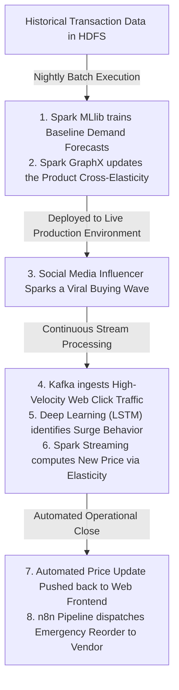

# **Supply Chain Demand Forecasting & Dynamic Pricing**

**The Business Need:** Retailers suffer massive losses from stock-outs (lost sales) and overstock (storage costs/markdowns). Furthermore, pricing needs to adjust dynamically based on incoming traffic and available stock, much like airline tickets or Amazon pricing.

**The Dataset:** [Instacart Market Basket Analysis (Kaggle)](https://www.google.com/search?q=https://www.kaggle.com/c/instacart-market-basket-analysis/data) or the [Retailrocket Recommender System Dataset (Kaggle)](https://www.kaggle.com/datasets/retailrocket/ecommerce-dataset). These datasets provide massive transaction histories. The Retailrocket dataset is particularly good because it includes a time-series file of `item_properties.csv`, showing how product prices and categories changed over time.

# **1\. Core Architectural Concept & Problem Definition**

In modern retail and e-commerce ecosystems, inventory misalignment costs businesses billions annually. Maintaining excessive inventory incurs high warehouse holding costs and leads to aggressive markdown cycles that erode profit margins. Conversely, stockouts cause direct revenue loss and degrade customer loyalty.

This production-grade system solves these problems by creating a closed-loop automated system where historical sales patterns predict baseline demand, and live traffic telemetry modulates pricing dynamically. By adjusting pricing based on real-time consumption velocity relative to a statistical baseline, the system manages demand spikes, forces a higher profit margin on viral items, and maximizes inventory shelf-life.

# **2\. The Mapping of Spark Capabilities to Business Problems**

To utilize the full power of Apache Spark, we divide the system into four execution engines, each running the specific technology best suited for the task:

### **A. Spark SQL & Core (The Data Fabric)**

* **The Problem:** Raw data arriving from warehouses, website clicks, and supplier ERPs is messy, structured differently, and massive.  
* **The Execution:** This is your data cleansing and ETL (Extract, Transform, Load) engine. It uses Spark SQL to read highly compressed, columnar **Parquet files** from **HDFS**, merges dimensional tables (like user profiles and product catalogs), and structures them into optimized data frames for the AI engines.

### **B. Spark MLlib (The Predictive Batch Layer)**

* **The Problem:** You need to forecast baseline customer demand for the next 30 days across thousands of different products while accounting for seasonality and trends.  
* **The Execution:** This runs during your nightly batch window. Spark MLlib distributes the training of classic Machine Learning algorithms (such as **Gradient Boosted Trees** or **Linear Regression**) across the entire Hadoop cluster. It evaluates every single product ID (SKU) and outputs a static baseline demand forecast for the upcoming day.

### **C. Spark GraphX / Graph Frames (The Relationship Layer)**

* **The Problem:** Products don't exist in a vacuum. If a user buys a specific mechanical tool, they are highly likely to buy a specific screw or oil. Changing the price of one item impacts others (**Cross-Elasticity**), and you must prevent your own products from destroying each other's sales (**Cannibalization**).  
* **The Execution:** You build a massive **Product Knowledge Graph** using Spark GraphX. Products are "nodes," and their co-purchase patterns or category similarities are the "edges." By running graph algorithms (like *PageRank* or *Community Detection*), the system groups highly dependent products together. If the streaming engine wants to raise the price of an item, it first queries the graph to ensure it doesn't accidentally tank the sales of a highly connected, high-margin accessory.

### **D. Deep Learning on Spark (The Real-Time Pattern Layer)**

* **The Problem:** E-commerce clickstream traffic is chaotic. Standard machine learning struggles to look at a sequence of 50 rapid user clicks and instantly predict, within a split second, if that user is about to abandon their shopping cart or if they are entering a viral buying frenzy.  
* **The Execution:** You integrate Deep Learning frameworks (like **TensorFlow On Spark** or **PyTorch** via Spark's distributed data mapping). You train a Deep Learning model—specifically a Recurrent Neural Network (RNN) or an LSTM—on historical sequence data. This model takes the live streaming click events from **Kafka**, processes the complex behavioral sequences across your worker nodes, and flags instant behavioral shifts.

### 

### 

### **E. Spark Structured Streaming (The Real-Time Execution Layer)**

* **The Problem:** Translating all these complex insights into immediate action at a scale of millions of operations per second.  
* **The Execution:** The continuous central nervous system. It ingests live traffic from **Kafka**, performs low-latency sliding-window calculations on sales velocity, fetches the nightly MLlib baseline forecast, cross-references the GraphX cannibalization rules, passes the sequence to the Deep Learning model, and outputs the final dynamic price.

# **3\. The Full End-to-End Professional User Journey**

To see how an enterprise executive leverages this unified AI stack, let's map out the operational lifecycle of a single viral product event:

### 

### **Phase 1: Infrastructure Foundation (Weeks 1-2)**

Before writing any AI models, you must establish a stable, distributed computing environment. Using Docker on your macOS environment is the most efficient way to simulate a multi-node cluster locally.

* **Step 1: Resource Allocation.** A full Spark/Hadoop/Kafka stack is resource-intensive. Configure your local Docker Desktop engine to allocate a minimum of 12GB to 16GB of RAM and multiple CPU cores to prevent bottlenecking during stream processing.  
* **Step 2: The Container Matrix.** Draft a comprehensive docker-compose.yml file. You will need containers for:  
  * **Zookeeper & Apache Kafka** (Message brokering)  
  * **Hadoop NameNode & DataNodes** (HDFS storage)  
  * **Spark Master & Spark Workers** (Distributed compute engine)  
  * **Redis** (In-memory cache for fast microsecond lookups)  
* **Step 3: Network Bridging.** Ensure all containers operate on the same Docker network so Spark can seamlessly read from HDFS and consume from Kafka.  
* **Step 4: Data Staging.** Download the Retailrocket dataset. Manually copy the historical events.csv and item\_properties.csv files directly into your HDFS container to simulate your pre-existing corporate data lake.

### **Phase 2: The Ingestion & Simulation Layer (Week 3\)**

You need a reliable mechanism to simulate the chaotic, high-throughput environment of a live e-commerce platform.

* **Step 1: Kafka Topic Configuration.** Create three strictly partitioned topics: live\_web\_traffic, inventory\_updates, and system\_alerts.  
* **Step 2: The Traffic Generator.** Write a Python script using confluent-kafka. This script will read a reserved portion of your dataset, parse the timestamps, and stream the JSON payloads into the live\_web\_traffic topic at varying speeds to simulate natural traffic, including artificial "surges."  
* **Step 3: Consumer Verification.** Write a simple terminal listener to verify that messages are landing in Kafka without latency or data loss.

### **Phase 3: The Nightly AI Batch Pipeline (Weeks 4-5)**

This phase builds the strategic "brain" of the operation, utilizing your historical data.

* **Step 1: ETL & Feature Engineering.** Write a PySpark Core job that extracts historical data from HDFS, cleanses it, and creates rolling 7-day and 30-day sales velocity features for every single product SKU.  
* **Step 2: MLlib Forecasting.** Implement a machine learning model (e.g., Gradient Boosted Trees) in PySpark to calculate the 30-day baseline demand forecast for each item.  
* **Step 3: GraphX Relationship Mapping.** Build a product knowledge graph to calculate cross-elasticity. Map which products are frequently bought together so the system knows which items are inextricably linked.  
* **Step 4: Cache Publishing.** Write the final daily forecasts and graph constraints into your Redis container. This ensures the streaming engine can access these baselines instantly without querying the heavy Hadoop cluster.

### **Phase 4: The Real-Time Deep Learning Engine (Weeks 6-7)**

This is the execution layer where the system makes autonomous financial decisions.

* **Step 1: Structured Streaming Setup.** Initialize a PySpark Streaming context that subscribes to your live\_web\_traffic Kafka topic, processing events in 1-minute tumbling windows.  
* **Step 2: Deep Learning Integration.** Implement your sequence model (e.g., an LSTM using TensorFlow/PyTorch integrated with Spark). Feed the live sequence of user clicks into the model to classify whether the current traffic is standard browsing or a high-intent viral surge.  
* **Step 3: The Pricing Algorithm.** For every window, calculate the live velocity. Pull the baseline forecast and graph constraints from Redis. If the deep learning model flags a surge and velocity exceeds the baseline, calculate the new optimized price using your elasticity formula.  
* **Step 4: Action Output.** Publish the newly calculated price to a new Kafka topic: automated\_pricing\_updates.

### **Phase 5: Workflow Automation & Executive Dashboard (Week 8\)**

The final phase translates your data engineering into tangible business operations.

* **Step 1: n8n Automation Integration.** Set up an n8n workflow listening via webhook to your system\_alerts Kafka topic. Configure a workflow so that if a product's inventory drops dangerously low during a surge, n8n automatically drafts a Purchase Order and sends a simulated email to the supplier for emergency restocking.  
* **Step 2: The Command Center.** Build an interactive web dashboard using Python (Streamlit or Dash). Connect it to your Redis cache and Kafka topics to visualize the live data.  
* **Step 3: Visual Analytics.** Implement live charts showing the forecasted demand line versus the actual streaming demand, a ticker of autonomous price changes, and a log of automatically triggered supply chain workflows.

This roadmap breaks down a massive enterprise architecture into logical, sequential engineering sprints.  
Which specific phase should we begin architecting first—would you like to start by drafting the docker-compose.yml for the infrastructure, or focus on the Python logic for the Kafka ingestion?  
