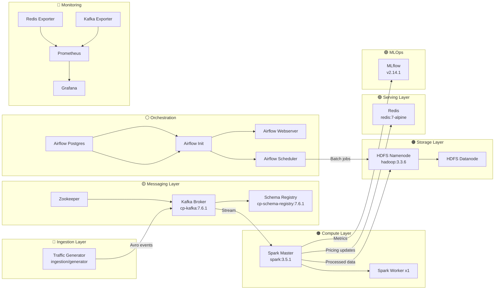
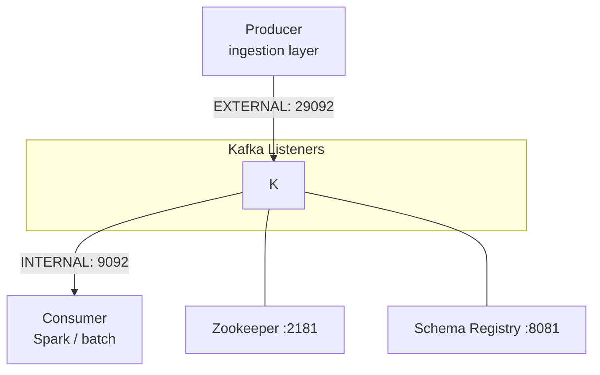
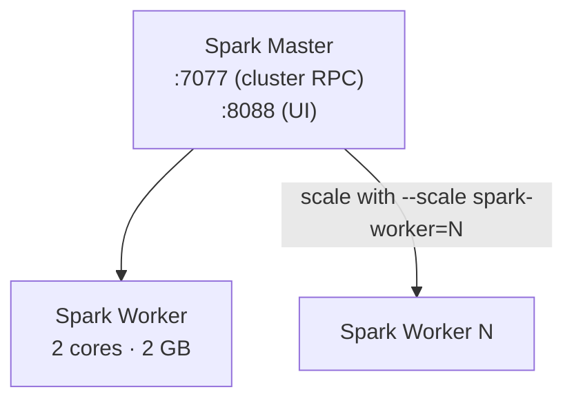
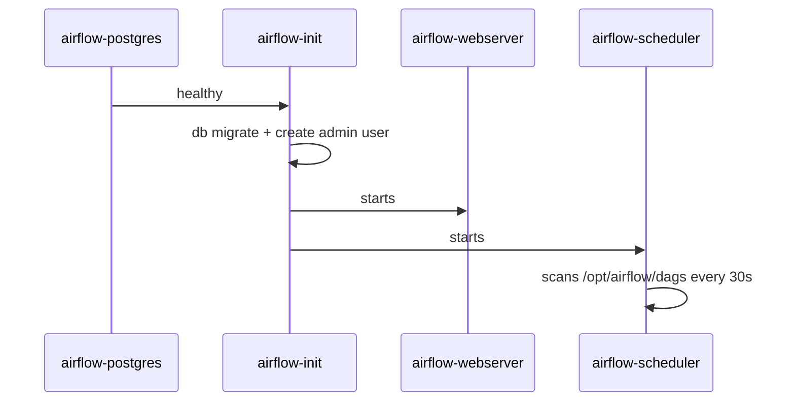
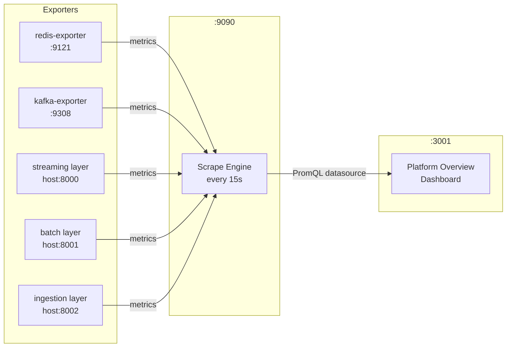
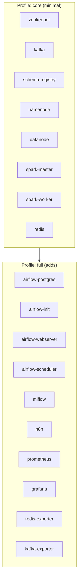

# Infrastructure Overview

**Supply Chain Forecasting — Local Data Platform**

This directory contains the complete infrastructure definition for the project: a 100% free, self-hosted, containerised data platform running on Docker Compose. It is designed to run entirely on a developer laptop at zero cost.

---

## Table of Contents

1. [Directory Structure](#1-directory-structure)
2. [Architecture Overview](#2-architecture-overview)
3. [Services Reference](#3-services-reference)
   - [Messaging — Kafka Stack](#31-messaging--kafka-stack)
   - [Storage — HDFS](#32-storage--hdfs)
   - [Compute — Spark](#33-compute--spark)
   - [Serving Layer — Redis](#34-serving-layer--redis)
   - [Orchestration — Airflow](#35-orchestration--airflow)
   - [Model Registry — MLflow](#36-model-registry--mlflow)
   - [Automation — n8n](#37-automation--n8n)
   - [Monitoring — Prometheus & Grafana](#38-monitoring--prometheus--grafana)
4. [Docker Compose Profiles](#4-docker-compose-profiles)
5. [Networking & Port Map](#5-networking--port-map)
6. [Persistent Volumes](#6-persistent-volumes)
7. [HDFS Configuration](#7-hdfs-configuration)
8. [Monitoring Stack Deep-Dive](#8-monitoring-stack-deep-dive)
9. [Helm Chart (Kubernetes Path)](#9-helm-chart-kubernetes-path)
10. [Terraform Stubs](#10-terraform-stubs)
11. [Teammate Guidelines — Step-by-Step](#11-teammate-guidelines--step-by-step)
12. [Troubleshooting](#12-troubleshooting)

---

## 1. Directory Structure

```
infra/
├── docker/
│   └── docker-compose.yml        # Single source of truth for the full local stack
├── hadoop/
│   └── config/
│       ├── core-site.xml         # Reference only — config injected via env vars
│       └── hdfs-site.xml         # Reference only — config injected via env vars
├── monitoring/
│   ├── prometheus/
│   │   └── prometheus.yml        # Scrape targets: redis, kafka, python layers
│   └── grafana/
│       ├── dashboards/           # Pre-built dashboard JSON files
│       └── provisioning/         # Auto-provisioned datasources & dashboards
├── helm/
│   └── supply-chain/             # Helm chart for Kubernetes deployment (local kind/minikube)
│       ├── Chart.yaml
│       ├── values.yaml
│       └── templates/            # kafka.yaml, namenode.yaml, redis.yaml, spark.yaml
├── terraform/
│   ├── main.tf                   # Inert manifest stub (no provider — safe, no cloud cost)
│   ├── variables.tf
│   └── README.md
└── README.md                     # This file
```

---

## 2. Architecture Overview

The platform is split into four logical layers that flow data from left to right.



### Data Flow Narrative

| Step | What happens |
|---|---|
| **1. Ingest** | `TrafficGenerator` publishes Avro-encoded events to Kafka topics (`live_web_traffic`, `inventory_updates`, etc.) |
| **2. Stream** | Spark Structured Streaming reads Kafka, applies the pricing engine, writes Gold-layer results to HDFS and hot prices to Redis |
| **3. Batch** | Airflow triggers nightly DAGs: reads Silver data from HDFS, trains/evaluates models, logs experiments to MLflow |
| **4. Serve** | The Streamlit dashboard reads low-latency prices from Redis and historical trends from HDFS |
| **5. Observe** | Prometheus scrapes all exporters every 15 s; Grafana displays the platform-overview dashboard |

---

## 3. Services Reference

### 3.1 Messaging — Kafka Stack



| Service | Image | Ports |
|---|---|---|
| `zookeeper` | `confluentinc/cp-zookeeper:7.6.1` | 2181 (internal) |
| `kafka` | `confluentinc/cp-kafka:7.6.1` | 9092 (internal), **29092** (host) |
| `schema-registry` | `confluentinc/cp-schema-registry:7.6.1` | **8081** |

**Dual listener design:**

| Listener | Protocol | Who uses it |
|---|---|---|
| `INTERNAL://kafka:9092` | PLAINTEXT | Other containers on `scf-net` |
| `EXTERNAL://localhost:29092` | PLAINTEXT | Host tools (`kafkacat`, test producers) |

**Kafka topics** (created by bootstrap):

| Topic | Partitions | Producer | Consumer |
|---|---|---|---|
| `live_web_traffic` | 6 | Traffic generator | Spark pricing engine |
| `inventory_updates` | 3 | Traffic generator | Spark batch |
| `system_alerts` | 3 | Any layer | n8n automation |
| `automated_pricing_updates` | 6 | Spark pricing engine | Redis writer / dashboard |

> `KAFKA_AUTO_CREATE_TOPICS_ENABLE=false` — topics must be created explicitly via `scripts/bootstrap.sh`.

---

### 3.2 Storage — HDFS

```mermaid
graph LR
    subgraph HDFS Cluster
        NN["Namenode<br/>:9870 UI · :9000 RPC"]
        DN["Datanode"]
        NN <-->|Block reports| DN
    end

    subgraph Named Volumes
        V1[hdfs-name]
        V2[hdfs-data]
    end

    NN --- V1
    DN --- V2

    subgraph Medallion Dirs
        B[/data/bronze]
        S[/data/silver]
        G[/data/gold]
    end

    DN --- B & S & G
```

| Property | Value |
|---|---|
| Image | `apache/hadoop:3.3.6` |
| Namenode UI | http://localhost:9870 |
| RPC endpoint | `hdfs://namenode:9000` |
| Replication factor | 1 (single datanode — local dev) |
| Permissions | Disabled (`dfs.permissions.enabled=false`) |
| Run as | `root` (required for Docker volume write access) |

**Medallion architecture:**

| Zone | Path | Content |
|---|---|---|
| Bronze | `/data/bronze` | Raw, immutable event copies from Kafka |
| Silver | `/data/silver` | Cleaned, deduplicated, typed events |
| Gold | `/data/gold` | Aggregated features ready for ML and dashboards |

> Configuration is injected via environment variables in `docker-compose.yml`, not by mounting the XML files in `hadoop/config/`. Those XML files are **reference documentation only**.

---

### 3.3 Compute — Spark



| Property | Value |
|---|---|
| Image | `apache/spark:3.5.1` |
| Master UI | http://localhost:8088 |
| Cluster RPC | `spark://spark-master:7077` |
| Default workers | 1 |
| Worker resources | 2 cores, 2 GB RAM each |

Scale workers horizontally at runtime:
```bash
docker compose -f infra/docker/docker-compose.yml up -d --scale spark-worker=3
```

> Port 8080 (Spark's default UI) is remapped to **8088** on the host to avoid conflicts with Oracle TNS Listener on Windows.

---

### 3.4 Serving Layer — Redis

| Property | Value |
|---|---|
| Image | `redis:7-alpine` |
| Port | **6379** |
| Persistence | AOF (`--appendonly yes`) |
| Role | Hot-price cache; read by Streamlit dashboard in <1 ms |

---

### 3.5 Orchestration — Airflow



| Service | Image | Port |
|---|---|---|
| `airflow-postgres` | `postgres:16-alpine` | 5432 (internal) |
| `airflow-webserver` | `apache/airflow:2.9.2` | **8082** |
| `airflow-scheduler` | `apache/airflow:2.9.2` | — |

- Login: `admin` / `admin`
- DAG folder mounted from `../../batch/airflow_dags`
- Executor: `LocalExecutor` (no Celery/workers needed for local dev)

> Port 8080 (Airflow's default) is remapped to **8082** on the host — port 8080 already used by Spark's internal default.

---

### 3.6 Model Registry — MLflow

| Property | Value |
|---|---|
| Image | `ghcr.io/mlflow/mlflow:v2.14.1` |
| UI | http://localhost:5000 |
| Backend store | SQLite at `/mlflow/mlflow.db` (persisted on `mlflow-data` volume) |
| Artifact store | `/mlflow/artifacts` (same volume) |

> A named volume (`mlflow-data`) is required — without it the container cannot create the SQLite file and crashes silently.

---

### 3.7 Automation — n8n

| Property | Value |
|---|---|
| Image | `n8nio/n8n:latest` |
| UI | http://localhost:5678 |
| Role | No-code workflow automation: alert routing, reorder triggers, Slack notifications |

---

### 3.8 Monitoring — Prometheus & Grafana



| Service | Image | Host Port | What it scrapes |
|---|---|---|---|
| `prometheus` | `prom/prometheus:v2.53.0` | **9090** | All targets below |
| `grafana` | `grafana/grafana:11.1.0` | **3001** | Prometheus datasource |
| `redis-exporter` | `oliver006/redis_exporter:v1.62.0` | 9121 | Redis metrics |
| `kafka-exporter` | `danielqsj/kafka-exporter:v1.7.0` | 9308 | Kafka broker metrics |

**Scrape jobs in `prometheus.yml`:**

| Job | Target | Required |
|---|---|---|
| `prometheus` | `localhost:9090` | ✅ Required |
| `redis` | `redis-exporter:9121` | ✅ Required |
| `kafka` | `kafka-exporter:9308` | ✅ Required |
| `streaming` | `host.docker.internal:8000` | ⚠️ Optional (app must be running) |
| `batch` | `host.docker.internal:8001` | ⚠️ Optional |
| `ingestion` | `host.docker.internal:8002` | ⚠️ Optional |

> Grafana is remapped to **3001** on the host — port 3000 was already in use on the dev machine. Login: `admin` / `admin`.

---

## 4. Docker Compose Profiles

The stack is split into two profiles to allow a lighter footprint during development:



| Profile | Use case | Command |
|---|---|---|
| `core` | Quick dev loop — only data plane | `docker compose ... --profile core up -d` |
| `full` | Full platform including monitoring & MLOps | `docker compose ... --profile full up -d` |

---

## 5. Networking & Port Map

All containers share the `scf-net` bridge network and resolve each other by **service name** (e.g., `kafka:9092`, `namenode:9000`). Only the ports listed below are exposed to the host.

| Service | Host Port | Container Port | Notes |
|---|---|---|---|
| Kafka (external) | **29092** | 29092 | Host tools connect here |
| Kafka (internal) | 9092 | 9092 | Containers only |
| Schema Registry | **8081** | 8081 | |
| HDFS Namenode UI | **9870** | 9870 | |
| HDFS RPC | **9000** | 9000 | `hdfs://localhost:9000` from host |
| Spark Master UI | **8088** | 8080 | Remapped from 8080 |
| Spark RPC | **7077** | 7077 | |
| Redis | **6379** | 6379 | |
| Airflow | **8082** | 8080 | Remapped from 8080 |
| MLflow | **5000** | 5000 | |
| n8n | **5678** | 5678 | |
| Prometheus | **9090** | 9090 | |
| Grafana | **3001** | 3000 | Remapped from 3000 |
| Redis Exporter | 9121 | 9121 | |
| Kafka Exporter | 9308 | 9308 | |

---

## 6. Persistent Volumes

Docker named volumes preserve state across container restarts. Running `docker compose down` keeps them; `docker compose down -v` deletes them.

| Volume | Mounted into | Stores |
|---|---|---|
| `hdfs-name` | `namenode:/opt/hadoop/data/namenode` | HDFS filesystem metadata |
| `hdfs-data` | `datanode:/opt/hadoop/data/datanode` | HDFS block data |
| `grafana-data` | `grafana:/var/lib/grafana` | Grafana user settings, saved dashboards |
| `airflow-db` | `airflow-postgres:/var/lib/postgresql/data` | Airflow task history, DAG state |
| `mlflow-data` | `mlflow:/mlflow` | MLflow SQLite DB + model artifacts |

> **If Namenode fails to start:** the volume may contain a stale filesystem. Fix: `docker compose ... down -v` then `up -d` to reformat.

---

## 7. HDFS Configuration

Configuration is passed as **environment variables** into the `apache/hadoop` container (not by mounting XML files). The `hadoop/config/` XML files are reference documents only.

### Key settings

| Env var in compose | XML property | Value | Why |
|---|---|---|---|
| `CORE-SITE.XML_fs.defaultFS` | `fs.defaultFS` | `hdfs://namenode:9000` | Default FS URI for all clients |
| `HDFS-SITE.XML_dfs.replication` | `dfs.replication` | `1` | Single datanode for local dev |
| `HDFS-SITE.XML_dfs.permissions.enabled` | `dfs.permissions.enabled` | `false` | No auth needed locally |
| `HDFS-SITE.XML_dfs.namenode.rpc-bind-host` | `dfs.namenode.rpc-bind-host` | `0.0.0.0` | Bind to all interfaces so containers on `scf-net` can reach RPC |
| `ENSURE_NAMENODE_DIR` | — | `/opt/hadoop/data/namenode/current` | Triggers auto-format on first boot if this path is absent |

---

## 8. Monitoring Stack Deep-Dive

### Prometheus scrape flow

```
Every 15 seconds:
  prometheus → redis-exporter:9121   → redis_* metrics
  prometheus → kafka-exporter:9308   → kafka_* metrics
  prometheus → host.docker.internal:8000  → streaming layer /metrics (optional)
  prometheus → host.docker.internal:8001  → batch layer /metrics (optional)
  prometheus → host.docker.internal:8002  → ingestion layer /metrics (optional)
```

### Grafana auto-provisioning

Grafana loads its configuration on startup from:

```
infra/monitoring/grafana/
├── provisioning/
│   ├── datasources/   → auto-connects to Prometheus at http://prometheus:9090
│   └── dashboards/    → auto-loads JSON dashboards from /var/lib/grafana/dashboards
└── dashboards/
    └── platform-overview.json   → pre-built platform metrics dashboard
```

No manual datasource setup is needed — everything is provisioned on first boot.

---

## 9. Helm Chart (Kubernetes Path)

The `helm/supply-chain/` chart mirrors the Docker Compose stack for portability. It is intended for a **free local Kubernetes cluster** (`kind` or `minikube`) only.

> ⚠️ **Do not deploy to a paid managed cluster** — that would violate the project's zero-cost rule.

### Templates

| File | What it creates |
|---|---|
| `kafka.yaml` | Zookeeper + Kafka StatefulSets + Services |
| `namenode.yaml` | HDFS Namenode + Datanode Deployments + PVCs |
| `redis.yaml` | Redis Deployment + Service |
| `spark.yaml` | Spark Master + Worker Deployments + Services |

### Local Kubernetes usage

```bash
# Install kind (free local Kubernetes)
kind create cluster --name scf

# Deploy the chart
helm install scf infra/helm/supply-chain \
  --set sparkWorker.replicas=1 \
  --set global.imagePullPolicy=IfNotPresent
```

---

## 10. Terraform Stubs

`infra/terraform/` contains an **inert manifest** documenting the equivalent cloud topology. No provider is configured — `terraform apply` cannot provision real resources.

```bash
cd infra/terraform
terraform init      # initialises with no provider
terraform validate  # syntax check only
# terraform plan — will warn "no provider" and exit safely
```

---

## 11. Teammate Guidelines — Step-by-Step

### Prerequisites

Ensure the following are installed before starting:

| Tool | Minimum version | How to install |
|---|---|---|
| Docker Desktop | Latest | https://www.docker.com/products/docker-desktop |
| Python | 3.11+ | https://www.python.org |
| make | Any | `winget install GnuWin32.Make` (Windows) |
| Git | Any | https://git-scm.com |

---

### Step 1 — Start Docker Desktop

Open **Docker Desktop** and wait for the status to show **"Engine running"** (green dot in the bottom-left corner).

Confirm in your terminal:

```powershell
docker info
```

You must see engine details with no errors before continuing.

---

### Step 2 — Python Environment (first time only)

From the project root (`supply-chain-forecasting/`):

```powershell
python -m venv .venv
.venv\Scripts\activate          # Windows
# source .venv/bin/activate    # Linux / Mac

pip install -U pip
pip install -e ".[dev]"
```

> Keep the venv active for all subsequent commands.

---

### Step 3 — Start the Stack

```powershell
# Full stack (recommended)
docker compose -f infra/docker/docker-compose.yml --profile full up -d

# Lighter footprint (no monitoring/MLflow/Airflow/n8n)
docker compose -f infra/docker/docker-compose.yml --profile core up -d
```

The first run downloads all images (~3–5 GB). Subsequent starts are instant.

Wait until all containers show `Started` or `Healthy`:

```powershell
docker compose -f infra/docker/docker-compose.yml ps
```

---

### Step 4 — Bootstrap (Kafka Topics + HDFS Directories)

> **Windows PowerShell users:** `bash` is not available. Run these native PowerShell equivalents.

#### 4a — Wait for Kafka

```powershell
# Run until you see broker API info (not an error)
docker compose -f infra/docker/docker-compose.yml exec -T kafka `
  kafka-broker-api-versions --bootstrap-server localhost:9092
```

#### 4b — Create Kafka topics

```powershell
@("live_web_traffic:6","inventory_updates:3","system_alerts:3","automated_pricing_updates:6") | ForEach-Object {
    $name,$parts = $_ -split ':'
    docker compose -f infra/docker/docker-compose.yml exec -T kafka `
      kafka-topics --create --if-not-exists `
      --bootstrap-server localhost:9092 `
      --topic $name --partitions $parts --replication-factor 1
    Write-Host "✔ topic: $name ($parts partitions)"
}
```

#### 4c — Create HDFS medallion directories

```powershell
@("bronze","silver","gold") | ForEach-Object {
    docker compose -f infra/docker/docker-compose.yml exec -T namenode `
      hdfs dfs -mkdir -p "/data/$_"
    Write-Host "✔ hdfs: /data/$_"
}
```

> **Linux / Mac / Git Bash users:** you can use `bash scripts/bootstrap.sh` instead of steps 4b–4c.

---

### Step 5 — Verify Service UIs

Open each URL in your browser to confirm services are live:

| Service | URL | Login |
|---|---|---|
| HDFS Namenode | http://localhost:9870 | — |
| Spark Master | http://localhost:8088 | — |
| Schema Registry | http://localhost:8081/subjects | — (returns `[]` when empty) |
| Airflow | http://localhost:8082 | `admin` / `admin` |
| MLflow | http://localhost:5000 | — |
| Prometheus | http://localhost:9090 | — |
| Grafana | http://localhost:3001 | `admin` / `admin` |
| n8n | http://localhost:5678 | — |

---

### Step 6 — Run the Tests

```powershell
# Unit tests (no Docker needed — runs against a local SparkSession)
pytest tests/unit -v

# Integration tests (stack must be running + bootstrap done)
pytest tests/integration -v -m integration

# End-to-end walking skeleton
pytest tests/e2e/test_walking_skeleton.py -v

# Everything
pytest tests/ -v
```

> First run of unit tests may take 30–60 seconds while the JVM (PySpark) initialises. This is normal.

---

### Step 7 — Tear Down

```powershell
# Stop containers, preserve all data volumes
docker compose -f infra/docker/docker-compose.yml --profile full down

# Stop containers AND delete all volumes (fresh start)
docker compose -f infra/docker/docker-compose.yml --profile full down -v
```

---

### Daily Workflow (after first setup)

```powershell
# Morning: start
docker compose -f infra/docker/docker-compose.yml --profile full up -d

# Work...

# Evening: stop (keeps volumes)
docker compose -f infra/docker/docker-compose.yml --profile full down
```

---

## 12. Troubleshooting

| Symptom | Cause | Fix |
|---|---|---|
| `dockerDesktopLinuxEngine: file not found` | Docker Desktop not running | Start Docker Desktop; wait for green status |
| Port conflict on startup (e.g. 3000, 8080) | Another app owns the port | `netstat -ano \| findstr :PORT` → kill process, or remap port in `docker-compose.yml` |
| `namenode` exits immediately after start | Corrupt `hdfs-name` volume from previous run | `docker compose ... down -v` → `up -d` again to reformat |
| `bash: not found` in `make up` | Windows PowerShell has no bash | Use the PowerShell bootstrap commands in Step 4 above |
| Schema Registry shows blank page in browser | It returns raw JSON (no HTML) | Expected — use a JSON Viewer browser extension, or check `http://localhost:8081/subjects` |
| MLflow UI unreachable / crashes | Missing `mlflow-data` volume (sqlite error) | Ensure volume is declared in `docker-compose.yml`; run `docker compose up -d --no-deps mlflow` |
| Integration tests skipped | Stack not running | Start the stack (Step 3) before running integration tests |
| Kafka topics not found | Bootstrap not run | Re-run Step 4b |
| HDFS dirs not found | Bootstrap not run | Re-run Step 4c |
| Prometheus targets show `DOWN` | Exporters not yet scraped | Wait 30 s after stack start, then re-check at http://localhost:9090/targets |
| Spark job OOM | Worker memory too low | Increase `SPARK_WORKER_MEMORY` in `docker-compose.yml` or scale workers |
